# RLHGNN

> **RLHGNN** (Reinforcement Learning-guided Heterogeneous Graph Neural Network) is a framework for **Next Activity Prediction** in Predictive Business Process Monitoring.

## 1. Project Overview

Traditional methods represent event log prefixes with a single fixed graph structure, which cannot adapt to the diversity of different prefixes. The core idea of RLHGNN is:

1. Define **4 heterogeneous graph representations** (graph configurations) for each event log prefix, each focusing on different process semantics;
2. Train a base GNN model for each graph configuration and evaluate its performance on the current prefix;
3. Train a **reinforcement learning (PPO/DQN)** decision model: given the current prefix, **dynamically select the most suitable graph configuration**;
4. Construct a hybrid graph dataset from the RL-selected "optimal graphs" and train the final next-activity prediction model.

### 4 Graph Configurations (`build_graph.py`)

| choice | Configuration | Edge Types |
| :---: | --- | --- |
| 0 | `forward` | Forward edges (activity → next activity) |
| 1 | `Bidirect` | Forward + backward edges |
| 2 | `forward_complex` | Forward + repeated-activity skip edges |
| 3 | `Bidirect_complex` | Bidirectional + repeated-activity skip edges |

Each node represents an event (with multi-dimensional attributes such as `activity` / `duration`), modeled by `HeteroSAGE` (heterogeneous SAGE convolution + LSTM aggregation + global attention pooling), which finally outputs the probability distribution over the next activity.

### Pipeline

```mermaid
flowchart LR
    A[Raw event log CSV] --> B[cut_train_test.py temporal split]
    B --> C[data_process.py prefix samples + 4 graph variants]
    C --> D[pre_main.py pretrain 4 base GNNs]
    D --> E[env_train.py train PPO decision model]
    E --> F[final_policy.py RL graph selection, hybrid graphs]
    F --> G[final_main.py train final prediction model]
    G --> H[metrics_final.py evaluation metrics]
```



---

## 2. Environment Setup

### 2.1 Install Dependencies

```bash
# PyTorch (install the build matching your CUDA version, see https://pytorch.org)
pip install torch

# DGL (graph deep learning library; must match your torch/CUDA version, see https://www.dgl.ai/pages/start.html)
pip install dgl

# Reinforcement learning libraries
pip install stable-baselines3 gymnasium

# Other dependencies
pip install numpy pandas scikit-learn imblearn tqdm matplotlib scipy pm4py
```

> **Note**: DGL must match the CUDA version of PyTorch. It is recommended to install the matching wheel, e.g. `pip install dgl -f https://data.dgl.ai/wheels/cu{version}/repo.html`.

### 2.2 Hardware Requirements

- A **GPU** is required for training (scripts default to `cuda:0`; change it via the `--gpu` argument or the `get_device()` function in the code).
- Running the full pipeline over all datasets × 5 seeds takes a long time; we recommend first validating the workflow on a small subset.

---

## 3. Data Preparation

### 3.1 Datasets

The project supports the following datasets (raw event logs go in `train_test_data/<dataset>/<dataset>.csv` with columns `case, activity, timestamp`; some datasets have extra columns such as `duration`):

- `bpi13_closed_problems`
- `bpi13_problems`
- `bpi13_incidents`
- `bpi12w_complete`
- `bpi12_all_complete`
- `BPI2020_Prepaid`
- `p2p` (source file is the OCEL file `p2p.jsonocel`; conversion required first)
- `OTC` (source file is the OCEL file `OTC.jsonocel`)

> The event logs can be obtained from 4TU Research Data. Some data is already included under `train_test_data/`.

### 3.2 (Optional) OCEL → Traditional Event Log

`p2p` and `OTC` are in OCEL format and must first be converted to traditional event logs:

```bash
python convert_jsonocel_to_eventlog.py
```

The converted CSVs are written to `train_test_data/<dataset>/<dataset>.csv`.

### 3.3 Temporal Train/Test Split

```bash
python cut_train_test.py
```

- Cases are sorted by start time; the **first 80% of cases form the training set and the last 20% form the test set** (temporal isolation to avoid data leakage).
- Only events occurring before the earliest test-case start time are kept in the training set.
- Outputs: `train_test_data/<dataset>/<dataset>_kfoldcv_0_train.csv` and `<dataset>_kfoldcv_0_test.csv`.

> The `list_event` list in the code controls which datasets are processed; edit it as needed before running.

---

## 4. Full Training Pipeline (5 Steps)

> All scripts below run from the **project root**. The `list_eventlog` / `seed_list` lists in the code control which datasets and random seeds are processed (default seeds `[133, 188, 456, 789, 1666]`); edit them as needed.

### Step 1: Data Preprocessing — `data_process.py`

```bash
python data_process.py
```

- Reads `train_test_data/<dataset>/<dataset>_kfoldcv_0_{train,test}.csv` and produces train/validation/test splits.
- Generates **prefix samples** for each case (predicting the next activity).
- Builds **4 graph configurations** of DGL heterogeneous graphs for every sample, saved under `raw_dir/<dataset>_0/` (two copies `part1/` and `part2/`, plus feature vocabularies, labels, etc.).

### Step 2: Pretrain Base GNN Models — `pre_main.py`

```bash
python pre_main.py
```

- Trains one `HeteroSAGE` model per dataset × seed × graph configuration (choice 0–3).
- Training details: NAdam + cosine annealing scheduler + AMP mixed precision + early stopping.
- Outputs: `Pretrain/action_{choice}_{seed}/<dataset>/<dataset>_fold0_model.pkl`

**Evaluate the pretrained models** (optional):

```bash
python metrics_pre.py
```

Writes metrics (Accuracy / Precision / Recall / F1 / AUC / PRAUC) to `result_Pretrain/action_{choice}_{seed}/<dataset>/`.

### Step 3: Train the RL Decision Model — `env_train.py`

```bash
python env_train.py
```

- Loads the 4 base GNNs from Step 2 as "environment evaluators".
- Builds a Gymnasium environment: state = prefix features (activity sequence, length, entropy, duration statistics, etc.), action = choose one of the 4 graph configurations (0–3), reward = prediction performance of the selected GNN.
- Trains a **PPO** policy (network `[256, 128, 64]`, cosine-annealed learning rate).
- Outputs the policy model: `RL_model/<dataset>/PPO_best_model_fold0_seed{seed}`.
- After training, `final_policy.py` is invoked automatically: it uses the optimal policy to pick a graph configuration for **every prefix** and generates the final hybrid graph dataset:
  - `graph_data/<dataset>_0_seed{seed}/train_graphs`
  - `graph_data/<dataset>_0_seed{seed}/val_graphs`
  - `graph_data/<dataset>_0_seed{seed}/test_graphs`

### Step 4: Train the Final Prediction Model — `final_main.py`

```bash
python final_main.py
```

- Trains the final `HeteroSAGE` model (next-activity classification) on the RL-generated hybrid graphs.
- Outputs: `final_train/<dataset>/seed{seed}/<dataset>_fold0_seed{seed}_model.pkl`
- Training time is recorded under `train_time/` and `pred_time/`.

### Step 5: Evaluate the Final Model — `metrics_final.py`

```bash
python metrics_final.py
```

- Computes Accuracy / Precision / Recall / F1 / AUC / PRAUC / Gmean on the test set.
- Results are written to `result_final_train/<dataset>/seed{seed}/<dataset>_seed{seed}.txt`.

---

## 5. One-Command Run (Linux / macOS)

`run_pipeline.sh` executes Steps 1→2→3→4→5 in order and stops if any step fails. Logs are saved under `logs/`:

```bash
chmod +x run_pipeline.sh
./run_pipeline.sh                     # default python
./run_pipeline.sh -p /usr/bin/python3 # specify the Python interpreter
./run_pipeline.sh -e myenv            # activate a conda environment
./run_pipeline.sh --skip-data         # skip data preprocessing (when raw_dir already exists)
./run_pipeline.sh --skip-pre          # skip pretraining
./run_pipeline.sh --skip-env          # skip RL training
./run_pipeline.sh --skip-final        # skip final training
./run_pipeline.sh --skip-metrics      # skip evaluation
```

> On Windows, run it in Git Bash / WSL, or simply execute each script from Section 4 (`python xxx.py`).

---

## 6. Ablation Study (Optional)

Used to validate the contribution of each graph configuration (and of the RL selection mechanism):

```bash
# Train ablation models: one model per dataset × seed × fixed graph configuration
python ablation_main.py
# Outputs: ablation_exp/<dataset>/action_{choice}/seed{seed}/<dataset>_fold0_seed{seed}_model.pkl

# Evaluate ablation models
python ablation_metrics.py
# Outputs: ablation_exp/result_ablation/<dataset>/action_{choice}/seed{seed}/

# Build oracle ceiling tables from the four ablation GNNs
python ablation_oracle_ceiling.py
# Outputs: ablation_exp/oracle_ceiling/seed133/<dataset>_oracle_table.csv
# Each CSV contains prefix_id, true_label, and the four action predictions.
# The script also writes oracle_accuracy and oracle_macro_f1 into a summary txt.
```

Statistical significance analysis (Friedman + Nemenyi test, CD diagram; fill in the metrics of each method manually):

```bash
python cd_diagram.py
```

---

## 7. Directory Structure & Outputs

| Directory / File | Description |
| --- | --- |
| `train_test_data/` | Raw event logs and split CSVs |
| `raw_dir/<dataset>_0/` | Preprocessed prefix samples, 4 graph variants, feature vocabularies |
| `Pretrain/action_{choice}_{seed}/` | Pretrained base GNN models |
| `RL_model/<dataset>/` | PPO decision models |
| `graph_data/<dataset>_0_seed{seed}/` | Final hybrid graph dataset selected by RL |
| `final_train/<dataset>/seed{seed}/` | Final prediction models |
| `result_Pretrain/` `result_final_train/` | Evaluation metric results (txt) |
| `ablation_exp/` | Ablation models and results |
| `logs/` | Logs of the one-command pipeline |

## 8. Core Files Overview

| File | Purpose |
| --- | --- |
| `convert_jsonocel_to_eventlog.py` | OCEL → traditional event log |
| `cut_train_test.py` | Temporal train/test split |
| `ProcessEventlog_one_graph.py` | Prefix sample generation |
| `build_graph.py` | Construction of the 4 heterogeneous graph variants |
| `data_process.py` | Data preprocessing entry point |
| `Pre_Train.py` / `pre_main.py` | Base GNN pretraining |
| `metrics_pre.py` | Evaluation of pretrained models |
| `env_train.py` | PPO decision model training |
| `final_policy.py` | Generates the final graph data with the RL policy |
| `final_main.py` | Final prediction model training |
| `metrics_final.py` | Final model evaluation |
| `ablation_main.py` / `ablation_metrics.py` | Ablation study |
| `cd_diagram.py` | Statistical tests and CD diagram |
| `model/model.py` | `HeteroSAGE` model definition |
| `MyDataset*.py` | DGL dataset wrappers |

## 9. FAQ

- **"File not found under `raw_dir/`"**: run `data_process.py` first.
- **`env_train.py` cannot find the pretrained models**: run `pre_main.py` first and make sure `Pretrain/action_{choice}_{seed}/` contains the model for the dataset.
- **Reduce runtime**: keep only one dataset and one seed (e.g., `seed_list = [133]`), and lower `iterations` in `env_train.py`.
- **Out of GPU memory**: reduce `--batch-size` (default 64).
- **Garbled characters in `bpi13_closed_problems`**: the code has a built-in `gbk` encoding mapping; other datasets default to `utf-8`. Add entries to `ENCODING_MAP` if needed.

## Tools

- **PyTorch**: deep learning framework
- **DGL**: graph neural networks
- **Stable-Baselines3 / Gymnasium**: reinforcement learning
- **Python**: programming language

## Data

Event logs for predictive business process monitoring can be obtained from [4TU Research Data](https://data.4tu.nl).